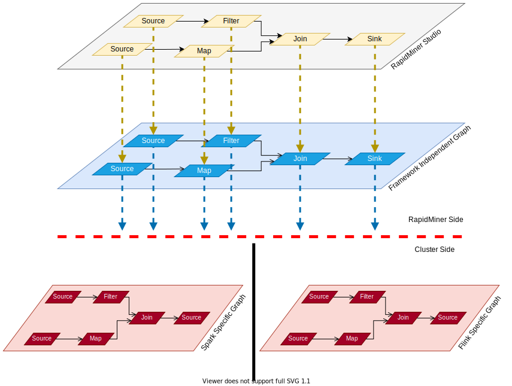
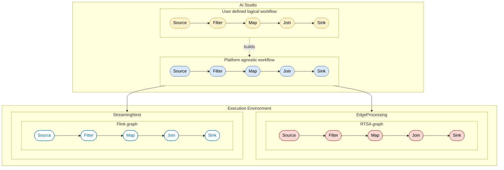

# TUC Edge-to-Cloud Extension
The Edge-to-cloud extension is an extension has been developed by the Technical University of Crete. The Edge-to-cloud extension
extends and modifies the RapidMiner Streaming Extension, 
which was originally created by RapidMiner GmbH. This extension provides operators that allow RapidMiner users to design and
automatically deploy arbitrary jobs that can operate either at Apache Flink Big Data clusters, or to edge nodes. Streaming operators will be 
deployed to Apache Flink and non-streaming jobs to edge devices running RTS Agents.

## Operator Additions and Enhancements 

- Enables the use of the *EdgeProcessing Operator*. Enables the automatic deployment of a workflow at an edge node running an RTS Agent. This extension is available at the RTS Agents Extension, created by the Technical University of Crete.
- *Federated Learning Operator*. Launches a TensorFlow-based Federated Learning job with configurable FedAvg/FedSGD parameters and produces a JSON artifact that is published to Kafka for orchestration.
- *Federated Learning Tuner Operator*. is a parameter-driven launcher that supports multiple modes (NS-3 simulation, NS-3 query, Flower training, and Flower inference) and produces a JSON artifact capturing the selected mode and its configuration, published to Kafka for orchestration.
- *Mental Fatigue Operator*. Processes firefighter eye-tracking features and outputs a predicted fatigue class using a pretrained KNN model integrated seamlessly into RapidMiner workflows.
- *TUC Read Kafka Topic Operator*. An enhanced version of the standard Read Kafka Topic operator that preserves the exact original data format on output, ensuring lossless passthrough of Kafka-consumed messages.

**_NOTE:_** To navigate to the new operators in AI Studio, look under *Operators &rarr; Extensions &rarr; Streaming &rarr; Crexdata Project &rarr; TUC  &rarr; Federated Learning/Augmented Reality/Kafka*.

## Changes from the Streaming Extension

- Spark support removed: the CREXDATA release targets Flink for streaming workloads and RTS Agents for everything else, so all Spark deployment code (modules, submission logic, serializers) is now deprecated and excluded from the build.

- RTS Agent & EdgeProcessing path: the optimizer pipeline in `com.rapidminer.extension.streaming.optimizer` now maps every optimized workflow operator either into a `StreamingNest` or an `EdgeProcessing` wrapper (runs on RTS Agent). EdgeProcessing handles the non-streaming (rapidminer) operator set.

- The optimizer module (i.e. the EdgeToCloud Optimization operator), responsible for recieving, rendering and sending the optimized workflow for execution is responsible for also connecting the wrapping operators (i.e. StreamingNest and EdgeProcessing) with the right type of Kafka operators. When two EdgeProcessing operators need to be able to communicate with each other, the respective parts of the workflow are augmented with the non streaming version of the Kafka read/write operators. In the case of StreamingNests, the Kafka operators which are added are the streaming kind. 

- Streamlined dictionary schema: the dictionary generated during process collection is rebuilt to include only the operators that appear in the designed workflow. This makes the serialized description smaller and easier to inspect.

- Leaner optimizer payloads: In the previous version, the workflow sent to the optimizer service would contain the entire list of parameters and not just the parameter chosen by the user. Trimming the unused alternatives eliminates the large request bodies that previously prevented responses from reaching RapidMiner Studio.

## Architecture
From a high level, this is how it looks like:
<!--  -->



1. User defines data stream processing workflow in AI Studio (GUI)
2. User starts process execution as usual (big, blue play button)
3. AI Studio collects workflow nodes, their configurations and builds a graph from them (platform independent)
4. AI Studio serializes this workflow graph
5. AI Studio submits platform-specific job (containing the workflow graph processor) + serialized graph
6. Flink/RTS Agents receive job (+ artifacts) and starts its execution
7. Platform-specific processor (main entry point for the job) deserializes, translates (into a platform specific representation) and executes workflow


## RTSAgent
More information about the Real Time Scoring Agents and the EdgeProcessing operator, along with the details about the modified Kafka operators can be found in the D3.2 deliverable and the tuc-rtsa-extension repo. 

## Necessary components from the previous Streaming Extension, developed by RapidMiner GmbH
The project comprises the following modules:

```
flink (module)
utility (module)
```

## Utility
The *utility* module contains common functionality needed by other modules (e.g.: HDFS, Kryo).
It is also the place where the framework independent stream graph lives.
RapidMiner users interact with the GUI to build processing workflows.
Under the hood, GUI elements, upon process execution, build such a framework independent stream graph for deployment.

## Flink
The *flink* module contains Apache Flink specific code.
It is basically a deployable unit which could almost be forwarded to a Flink cluster as it is.
However, it first needs to be equipped with a framework independent stream graph, which happens at runtime (will be embedded in the JAR copy).
Clusters need the RaaP artifacts which can be generated by the following _Gradle_ tasks: ```rapidminer-as-plugin:shadowJar```, ```rapidminer-as-plugin-common:shadowJar```

## Regarding the RaaP modules
```
rapidminer-as-plugin (module)
rapidminer-as-plugin-bridge (module)
rapidminer-as-plugin-common (module)
```

* This endeavour should be considered as a best-effort feature/service (i.e. probably not everything will work as smoothly as on your computer, where Studio is in full control of the process)
* The platforms will need to be equipped with the necessary tools/libraries/artifacts to be able to support RapidMiner model deployment (i.e. custom docker images will be derived)
* RapidMiner should not be naively (class-)loaded by the underlying platform, since there could be differences in library usage to the underlying platform's (e.g.: apache-commons, etc.)

### Approach

Here we will detail certain design decisions we made to address the above assumptions.

* RaaP, using PF4J (https://pf4j.org/), is being literally brought in as a plugin, which itself is capable of loading plugins on its own (RapidMiner extensions)
* PF4J provides a simple, reversed plugin loading mechanism, which in this case is exactly what we need:
  1. load everything that is related to RapidMiner or its dependencies from its own artifacts (that's why we need to set up new images, basically need to embed a complete RapidMiner installation)
  2. load everything else, mostly JDK/core Java utilities, using the host's loader (platform classloader that starts the stream processing job)
  3. we, of course, realize this requires the collaboration of the plugin (RaaP) and its plugins themselves (accessing the system classloader for whatever reason could be tricky)
  4. there are probably, numerous other reasons why this won't work as smoothly as in Studio, but that's why we set out to make it a best-effort service in the first place, without putting too much effort in it
* The new module ```rapidminer-as-plugin-common```:
    1. will already be placed on the cluster, so that stream processing jobs as well as RaaP can use it
    2. houses PF4J (common-)utilities for loading RaaP + custom data containers to communicate data toward/from it in a RapidMiner independent way
    3. custom data containers seem to be necessary since we cannot allow any dependency on RapidMiner code from a stream processing job (due to potential dependency hell, see above)
    4. however, we can allow both, stream processing code (e.g.: Flink job) and RaaP to use the same containers for communicating data in both directions (since these classes would be loaded by a common parent classloader)
* The new module ```rapidminer-as-plugin-bridge```:
    1. bridge between non-RaaP code (e.g.: Flink job wanting to use a RapidMiner model for scoring) and RaaP code, for instance for the purpose of conversion between the 2 realms
    2. this mediation is also need in Studio when setting up the environment
    3. depends on: ```rapidminer-as-plugin-common``` and RapidMiner-core
* The new module ```rapidminer-as-plugin```:
  1. will be the wrapper around RapidMiner (~RaaP itself) and be responsible for initializing the RapidMiner environment, thus enabling model scoring
  2. will already be placed on the cluster, where PF4J, upon request, will be able to load it as its plugin (packaged/shipped as a fat-Zip)
  3. depends on: ```rapidminer-as-plugin-common``` and ```rapidminer-as-plugin-bridge```


## Using the Extension

1) Install AI Studio / RapidMiner Studio and start it once so the extension folder is created: `~/.AltairRapidMiner/AI\ Studio/2024.1.0/extensions/`

2) Clone this repository and the [`tuc-rtsa-extension`](https://github.com/DBanelas/rm-crexdata-extensions/tree/main/tuc-rtsa-extension)

3) From the root of this repo run `./gradlew installExtension`. The task builds the Edge-to-Cloud extension and copies the resulting JAR into the RapidMiner extensions directory that AI Studio watches.

4) Do the same for the tuc-rtsa-extension

5) Restart AI Studio

6) For optimized deployments, start the CREXDATA optimizer service before you execute workflows and place the logical workflow inside the `EdgeToCloud Optimization` operator.

## Version
Dependency versions throughout the project:
* **Flink**: 1.9.2 with Scala 2.11
* **AI Studio**: 2024.1.0+
**AI Hub**: 2024.1.0+
