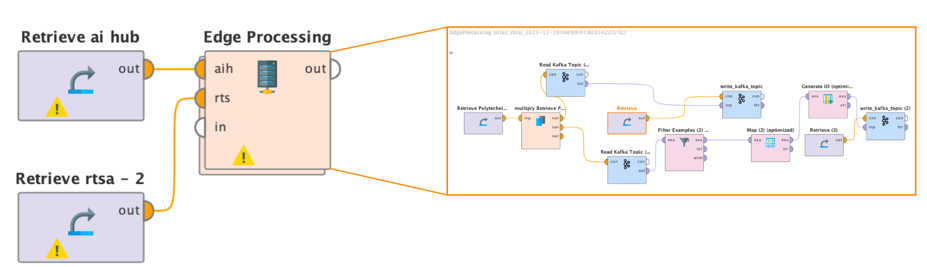

RTS Agents Extension 
=============================
This repository contains all the code for the TUC RTS Agents Extension, developed by the Technical University of Crete, for RapidMiner Studio. This extension introduces the Edge Processing operator and an updated-corrected version of Deploy Project operator.
_______
### Prerequisite
* Requires Gradle 8.2.1+ (use the Gradle wrapper shipped with this template or get it [here](http://gradle.org/installation))

* Requires Java 11

* Requires AI Studio 2024.1.0+
* Requires AI Hub 2024.1.0+

### Edge Processing Operator 

The *Edge Processing operator* enables user to create a workflow that can be deployed to the connected RTS agent for execution. The operator performs the following steps:
1. Packages the nested workflow into a zip file
2. Uploads the zip file to the connected AI Hub 
3. Via AI Hub, the workflow is sent to the connected RTS agent for execution
The operator allows the user—via its parameters—to include the contents of a selected repository/directory. These files are uploaded along with the workflow, making them available on the RTS agent during execution.

### Deploy Project Operator
*Deploy project* operator originally lives inside the Admin extension of RapidMiner, but has been modified in this extension to resolve several issues present in the original implementation [[docs]](https://docs.rapidminer.com/latest/studio/operators/extensions/Admin%20Tools/rtsa/deploy_project_rtsa.html). This operator allows the user to deploy an existing project on AI Hub to the connected RTS agent. Deploy project operator is used inside the Edge Processing operator for sending the nested workflow to AI Hub. 

___
### How to install the extension in AI Studio
1. Clone the tuc rtsa extension repository

2. Build and install your extension by executing the _installExtension_ Gradle task 

3. Start AI Studio and check whether your extension has been loaded, by navigating to *Operators &rarr; Extensions &rarr; TUC Rtsa Extension  &rarr; Rtsa*
